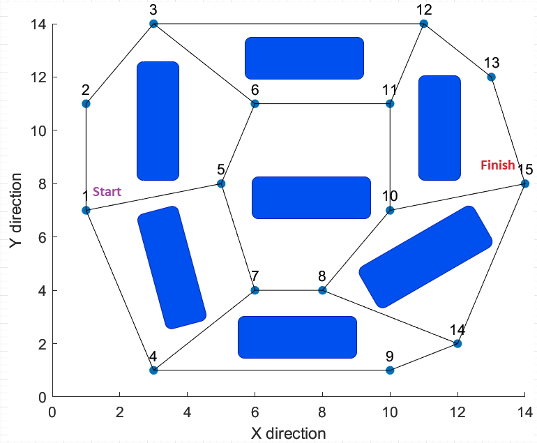
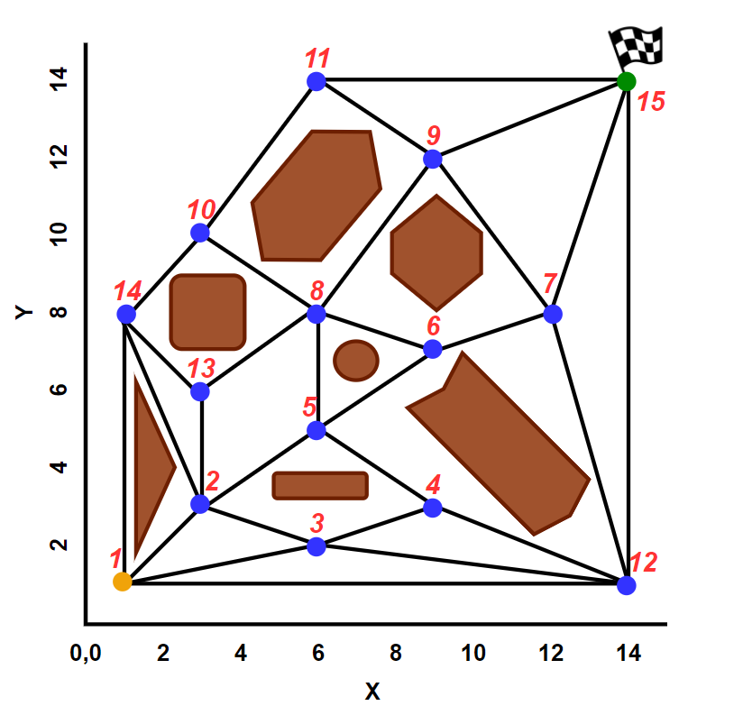
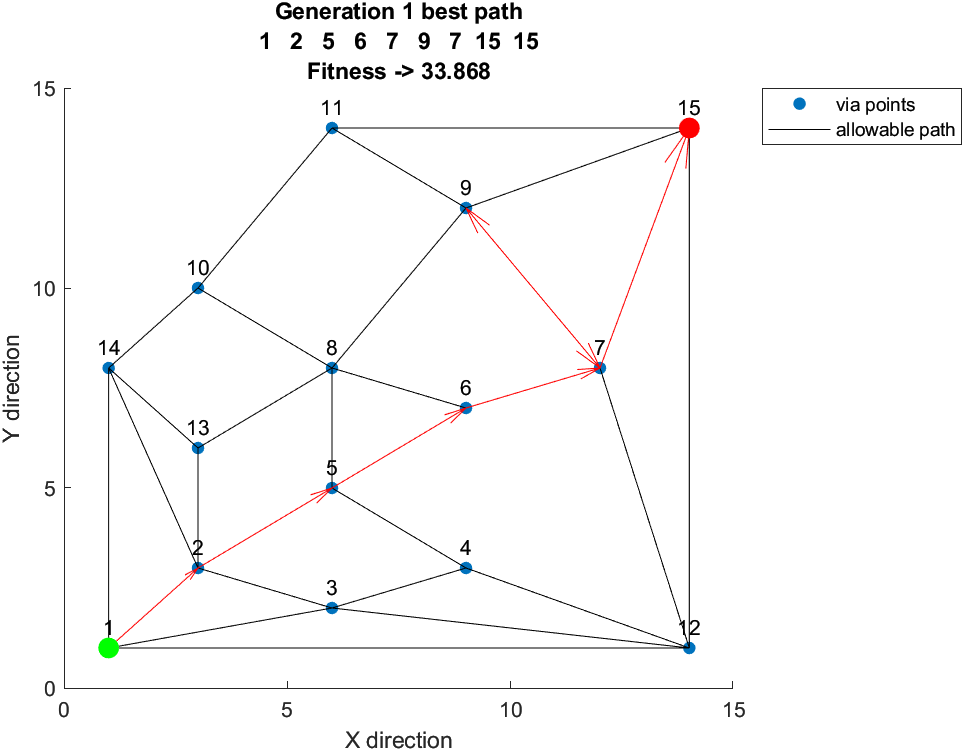

# Mobile_Robot_Path_Planning_Genetic_Algorithm
Solves collision free shortest path planning problem for a mobile robot in 2D static environment using Genetic Algorithm

## Version - 5.0
## Date - 11/24/2020
## Author - Azmyin Md. Kamal, G.R.A, UL Lafayette, Louisiana, USA

# Images
### Enviroment 1

### Enviroment 2

### Sample Result

# Features
1. complex 2D static path to test the algorithm
2. True Elitisim - copy and paste best candidate into next generation
2. Bit Flip mutation operator
3. Multi point crossover @ 90% probability
4. Scalable to N number of candidates
5. Mating Pool - Numerical Roullete Wheel - choose with replacement
5. Fixed length chromosome
6. Automatic best path plot per generation with fitness value and distance travelled

# Instructions
* Run GA_robot_path_planning.mlx file to find best path using GA. The file is self explanatory and you may simply run it to execute simulation the default map (depending on which map you chose, two maps are available)
* The map needs to be predefined before executing simulation. Thus, this is a global path planning problem.
* Define via point coordinates and allowable vertices in load_dat.m file PRIOR to running simulation. Refer to [2] in Technical Report section
* To update or modify the code, please use the 'HARDCODED' keyword to first ascertain which portion of the codes are hardcoded to this problem.

# Known Dependencies
* MATLAB 2019, standard functions *randperm, rand*
* *label* points by Adam Danz, (https://www.mathworks.com/matlabcentral/fileexchange/46891-labelpoints)

## Technical Report
1. Kamal, Azmyin M. (2020), "Collison-Free, Shortest-Path Planning for Mobile Robots in 2D Static Workspace using Genetic Algorithm" [TODO URL]
2. G. Nagib and W. Gharleb (2004), "Path planning for a mobile robot using using genetic algorithm" (http://citeseerx.ist.psu.edu/viewdoc/summary?doi=10.1.1.324.42)
